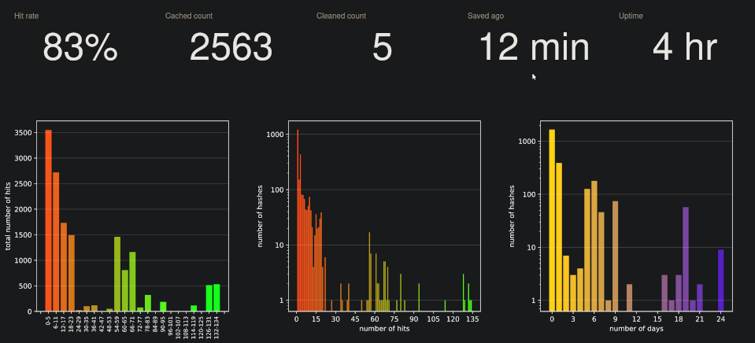

# Cache for `clang-tidy` static analysis results

## Introduction 

`clang-tidy-cache` is a command-line application which "wraps" invocations
of the `clang-tidy` static analysis tool and caches the results of successful
runs of `clang-tidy`. On subsequent invocations of `clang-tidy` on an unchanged
translation unit, the result is retrieved from the cache and `clang-tidy`
is not executed. For most C/C++ projects this allows to have static analysis
checks enabled without paying the cost of excessive build times when re-checking
the same unchanged source code.

## How it works

`clang-tidy-cache` scans the command-line arguments passed to `clang-tidy`,
relevant `clang-tidy` configuration files, all source files being analyzed
and makes a hash uniquely identifying the invocation of `clang-tidy`.

Then it searches if its database contains that hash. If it does, `clang-tidy-cache`
returns immediately without invoking `clang-tidy`, otherwise `clang-tidy`
is executed and if it finishes without error, the hash is stored in the database.

### Local mode

`clang-tidy-cache` by default works as a standalone application and it stores
its hash database in a directory on the local file system. The location
is determined by the `CTCACHE_DIR` environment variable, by default it
is a sub-tree in the temporary directory. This means that the cache may
be cleared on reboot. If you want the cache to be persistent you need
to specify a path to a disk-backed file system directory.

### Client/server mode

`clang-tidy-cache` can also work in client/server mode where a dedicated
HTTP server (the `clang-tidy-cache-server` executable) can be used to store
and retrieve the cached hashes.
This mode is enabled by setting the `CTCACHE_HOST` (`localhost` by default)
and optionally `CTCACHE_PORT` (`5000` by default) environment variables.

## Usage

### The client

The most convenient way how to use `clang-tidy-cache` is to create a wrapper
shell script called `clang-tidy` in a directory which is listed
in the executable search path list, before the directory where the real
`clang-tidy` executable is located (on POSIX systems for example in `/opt/bin`),

The wrapper script typically contains something along these lines:

```shell
#!/bin/bash
REAL_CT=/full/path/to/clang-tidy
/path/to/clang-tidy-cache "${REAL_CT}" "${@}"
```

You can also use the [prepared wrapper script](./clang-tidy) from
the repository and adapt it to your needs.

Make sure to set write permissions properly to prevent tampering by unauthorized
users!

### Running the server

The cache HTTP server can simply be run by executing `clang-tidy-cache-server`.
The server stores the hash database by default in the `.cache/` subdirectory
of the home directory of the user under whose account it is executed.
This can be changed by a command-line option.

Invoke `clang-tidy-cache-server` with the `--help` argument to see all available
command-line options.

> [!NOTE]
> To effectively share cache between clients you will likely need to use the `CTCACHE_STRIP` option. More information in the [overview presentation (Extras section)](doc/overview.pdf) ([See Also](#see-also) section).

#### As systemd service

The `systemd/` sub-directory also contains service file(s) that can be used
to run the server as a systemd service (for example on a RPi on the local
network).

#### In a docker container

The server can also be run in a [Docker](https://www.docker.com/) container.
The provided `Dockerfile` can be used to build the docker image.

```shell
docker build -t ctcache .
```

The `CTCACHE_PORT` docker environment variable can be used to set the server
port number.

```shell
docker run -e CTCACHE_PORT=5000 -p "80:5000" -it --rm --name ctcache ctcache
```

In order to make the saved cache data persistent in Docker, you can create
a [volume](https://docs.docker.com/storage/volumes/) and map it
to the `/var/lib/ctcache` directory:

```shell
docker volume create ctcache
docker run -p "80:5000" -v "ctcache:/var/lib/ctcache" -it --rm --name ctcache ctcache
```

### Environment variables

The client and server can be configured by setting the following environment
variables:

| variable                         |client|server| description                                                      |
|----------------------------------|:----:|:----:|------------------------------------------------------------------|
| `CTCACHE_CLANG_TIDY`             |  ✓   |      | path to the `clang-tidy` executable                              |
| `CTCACHE_DISABLE`                |  ✓   |      | disables cache, always runs `clang-tidy`                         |
| `CTCACHE_SKIP`                   |  ✓   |      | disables analysis altogether, returns OK                         |
| `CTCACHE_STRIP`                  |  ✓   |      | list of strings stripped from inputs                             |
| `CTCACHE_STRIP_SRC`              |  ✓   |      | If set to true, apply strip paths to source code as well         |
| `CTCACHE_DUMP`                   |  ✓   |      | dumps all hash inputs into a file                                |
| `CTCACHE_DUMP_DIR`               |  ✓   |      | the directory to dump diagnostic info                            |
| `CTCACHE_DEBUG`                  |  ✓   |      | enables debugging output                                         |
| `CTCACHE_DIR`                    |  ✓   |      | the cache storage directory in local mode                        |
| `CTCACHE_EXCLUDE_HASH_REGEX`     |  ✓   |      | regular expression of hashes that should not be cached           |
| `CTCACHE_SAVE_OUTPUT`            |  ✓   |      | saves the stdout output of `clang-tidy` in the cache             |
| `CTCACHE_SAVE_ALL`               |  ✓   |      | save the output even when `clang-tidy` exited with error         |
| `CTCACHE_KEEP_COMMENTS`          |  ✓   |      | include source comments (e.g. `NOLINT`) in the hash              |
| `CTCACHE_LOCAL`                  |  ✓   |      | enables the local cache                                          |
| `CTCACHE_NO_LOCAL_STATS`         |  ✓   |      | disables keeping local cache statistics                          |
| `CTCACHE_NO_LOCAL_WRITEBACK`     |  ✓   |      | disables storage of remote cache hits to the local cache         |
| `CTCACHE_S3_BUCKET`              |  ✓   |      | the S3 bucket to store cache remotely                            |
| `CTCACHE_S3_FOLDER`              |  ✓   |      | the prefix directory in S3, w/o leading and trailing `/`         |
| `CTCACHE_S3_NO_CREDENTIALS`      |  ✓   |      | if set, script won't try to put objects to S3                    |
| `CTCACHE_S3_READ_ONLY`           |  ✓   |      | if set, script won't try to put objects to S3                    |
| `CTCACHE_PROTO`                  |  ✓   |      | protocol for connecting to the server                            |
| `CTCACHE_HOST`                   |  ✓   |  ✓   | hostname or IP address of the server                             |
| `CTCACHE_HOST_READ_ONLY`         |  ✓   |      | if set, script won't try to push objects to server               |
| `CTCACHE_PORT`                   |  ✓   |  ✓   | listening port of the server                                     |
| `CTCACHE_WEBROOT`                |      |  ✓   | directory containing static server files                         |
| `CTCACHE_GCS_BUCKET`             |  ✓   |      | the Google Cloud Storage bucket to store cache remotely          |
| `CTCACHE_GCS_FOLDER`             |  ✓   |      | the prefix in GCS, w/o leading and trailing `/`                  |
| `CTCACHE_GCS_NO_CREDENTIALS`     |  ✓   |      | if set, script won't try to put objects to GCS                   |
| `CTCACHE_GCS_READ_ONLY`          |  ✓   |      | if set, script won't try to put objects to GCS                   |
| `CTCACHE_REDIS_HOST`             |  ✓   |      | hostname or IP address of Redis server                           |
| `CTCACHE_REDIS_PORT`             |  ✓   |      | port of the Redis server (default 6379)                          |
| `CTCACHE_REDIS_USERNAME`         |  ✓   |      | user name to connect to the Redis server                         |
| `CTCACHE_REDIS_PASSWORD`         |  ✓   |      | password to connect to the Redis server                          |
| `CTCACHE_REDIS_NAMESPACE`        |  ✓   |      | namespace to store objects in Redis (default `/ctcache`)         |
| `CTCACHE_REDIS_READ_ONLY`        |  ✓   |      | if set, script won't try to put objects to Redis                 |
| `CTCACHE_SOCKET_CONNECT_TIMEOUT` |  ✓   |      | Socket connect timeout, seconds, parsed as float (default `0.1`) |
| `CTCACHE_SOCKET_TIMEOUT`         |  ✓   |      | Socket timeout, seconds, parsed as float (default `10.0`)        |


### The dashboard

The clang tidy cache's HTTP server also serves a couple of web pages
that are designed to be viewed in a browser.
The main one is the dashboard that can be accessed by visiting `/` or
`/static/index.html` at the server's site. For example if the server host name
is `localhost` and port is `5000` then the dashboard can be visited by
typing `http://localhost:5000/` into the browser's address bar.




It displays basic information about the cache, like cache hit rate, number
of cached hashes, uptime, etc. and some charts providing information about
the current state of the server.

## See also

There is a presentation describing the motivation, implementation, deployment
and configuration options, and some performance measurements
[in the doc subdirectory](doc/overview.pdf).
